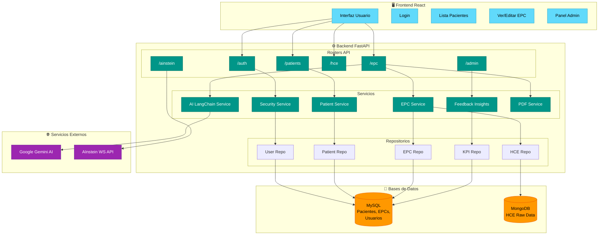

# AInstein Backend - Guía de Instalación y Despliegue

Sistema de backend para la plataforma AInstein/EPICRISIS - Generación inteligente de epicrisis clínicas.

---

## 📋 Requisitos Previos

| Requisito | Versión Mínima |
|-----------|----------------|
| Python | 3.11+ |
| MySQL/MariaDB | 8.0+ |
| MongoDB | 6.0+ |
| Git | 2.30+ |

---

## 🚀 Instalación Paso a Paso

### 1. Clonar el Repositorio

```bash
git clone https://github.com/zeron-team/ainstein_be.git
cd ainstein_be
```

### 2. Crear Entorno Virtual

```bash
python3 -m venv .venv
source .venv/bin/activate  # Linux/Mac
# .venv\Scripts\activate   # Windows
```

### 3. Instalar Dependencias

```bash
pip install --upgrade pip
pip install -r requirements.txt
```

### 4. Configurar Variables de Entorno

Crear archivo `.env` en la raíz del proyecto:

```env
# ─────────────────────────────────────────────────────────────
# Base de Datos MySQL
# ─────────────────────────────────────────────────────────────
DB_HOST=localhost
DB_PORT=3306
DB_NAME=ainstein_db
DB_USER=ainstein_user
DB_PASSWORD=tu_password_seguro

# ─────────────────────────────────────────────────────────────
# MongoDB (para HCE/historial clínico)
# ─────────────────────────────────────────────────────────────
MONGO_URI=mongodb://localhost:27017
MONGO_DB=ainstein_hce

# ─────────────────────────────────────────────────────────────
# Seguridad JWT
# ─────────────────────────────────────────────────────────────
JWT_SECRET_KEY=tu_clave_secreta_muy_larga_y_segura_123
JWT_ALGORITHM=HS256
ACCESS_TOKEN_EXPIRE_MINUTES=1440

# ─────────────────────────────────────────────────────────────
# Google Gemini API (para generación de EPC con IA)
# ─────────────────────────────────────────────────────────────
GOOGLE_API_KEY=tu_api_key_de_google_gemini

# ─────────────────────────────────────────────────────────────
# Integración con Sistema Externo (AInstein WS)
# ─────────────────────────────────────────────────────────────
AINSTEIN_WS_BASE_URL=https://api.ainstein.com.ar
AINSTEIN_WS_TOKEN=tu_token_ws

# ─────────────────────────────────────────────────────────────
# Servidor
# ─────────────────────────────────────────────────────────────
CORS_ORIGINS=http://localhost:5173,https://tudominio.com
DEBUG=false
```

### 5. Crear Base de Datos MySQL

```sql
CREATE DATABASE ainstein_db CHARACTER SET utf8mb4 COLLATE utf8mb4_unicode_ci;
CREATE USER 'ainstein_user'@'localhost' IDENTIFIED BY 'tu_password_seguro';
GRANT ALL PRIVILEGES ON ainstein_db.* TO 'ainstein_user'@'localhost';
FLUSH PRIVILEGES;
```

### 6. Ejecutar Migraciones

```bash
alembic upgrade head
```

### 7. Crear Usuario Administrador

```bash
python create_admin_user.py
```

### 8. Iniciar el Servidor

**Desarrollo:**
```bash
uvicorn app.main:app --reload --host 0.0.0.0 --port 8000
```

**Producción (con Gunicorn):**
```bash
gunicorn app.main:app -w 4 -k uvicorn.workers.UvicornWorker -b 0.0.0.0:8000
```

---

## 📁 Estructura del Proyecto

```
ainstein_be/
├── app/
│   ├── __init__.py
│   ├── main.py                    # Punto de entrada FastAPI
│   │
│   ├── adapters/                  # Adaptadores externos
│   │   └── mongo_client.py        # Cliente MongoDB
│   │
│   ├── core/                      # Configuración central
│   │   ├── config.py              # Variables de entorno
│   │   ├── deps.py                # Dependencias (DB sessions)
│   │   └── security.py            # JWT y autenticación
│   │
│   ├── db/                        # Base de datos
│   │   ├── base.py                # Base declarativa SQLAlchemy
│   │   ├── session.py             # Sesión de BD
│   │   └── migrations/            # Alembic migrations
│   │       └── versions/
│   │
│   ├── domain/                    # Modelos del dominio
│   │   ├── enums.py               # Enumeraciones
│   │   ├── models.py              # Modelos SQLAlchemy
│   │   └── schemas.py             # Schemas Pydantic
│   │
│   ├── repositories/              # Capa de acceso a datos
│   │   ├── admission_repo.py
│   │   ├── branding_repo.py
│   │   ├── epc_repo.py
│   │   ├── hce_repo.py
│   │   ├── kpi_repo.py
│   │   ├── patient_repo.py
│   │   └── user_repo.py
│   │
│   ├── routers/                   # Endpoints API
│   │   ├── admissions.py          # /admissions
│   │   ├── ainstein.py            # /ainstein (integración WS)
│   │   ├── auth.py                # /auth (login, logout)
│   │   ├── config.py              # /config (branding)
│   │   ├── epc.py                 # /epc (epicrisis)
│   │   ├── files.py               # /files (PDF)
│   │   ├── hce.py                 # /hce (historial clínico)
│   │   ├── health.py              # /health (healthcheck)
│   │   ├── ingest.py              # /ingest (carga datos)
│   │   ├── patients.py            # /patients
│   │   ├── stats.py               # /stats (KPIs)
│   │   └── users.py               # /users
│   │
│   ├── services/                  # Lógica de negocio
│   │   ├── ai_gemini_service.py   # Generación IA básica
│   │   ├── ai_langchain_service.py# Generación IA avanzada
│   │   ├── epc_history.py         # Historial de EPCs
│   │   ├── epc_service.py         # Servicio principal EPC
│   │   ├── feedback_insights_service.py  # Análisis feedback
│   │   ├── feedback_llm_analyzer.py      # LLM para feedback
│   │   ├── hce_parser.py          # Parser de HCE
│   │   ├── ingest_service.py      # Ingesta de datos
│   │   ├── llm_usage_tracker.py   # Tracking costos LLM
│   │   ├── patient_service.py
│   │   ├── pdf_service.py         # Generación PDF
│   │   ├── rag_service.py         # RAG (future)
│   │   └── vector_service.py      # Vector DB (future)
│   │
│   ├── utils/                     # Utilidades
│   │   ├── epc_pdf.py             # Templates PDF
│   │   └── normalize_ws_payload.py# Normalización WS
│   │
│   └── scripts/
│       └── bootstrap_admin.py
│
├── .env                           # Variables de entorno (NO commitear)
├── .gitignore
├── alembic.ini                    # Configuración Alembic
├── create_admin_user.py
├── requirements.txt
└── README.md
```

---

## 🔄 Diagrama de Flujo del Sistema



---

## 📡 Endpoints Principales

| Método | Endpoint | Descripción |
|--------|----------|-------------|
| POST | `/auth/login` | Autenticación usuario |
| GET | `/patients` | Listar pacientes |
| POST | `/patients` | Crear paciente |
| GET | `/epc/{patient_id}` | Obtener EPC |
| POST | `/epc/{patient_id}/generate` | Generar EPC con IA |
| PUT | `/epc/{id}` | Actualizar EPC |
| GET | `/hce/{patient_id}` | Obtener HCE de MongoDB |
| POST | `/epc/{id}/feedback` | Enviar feedback |
| GET | `/epc/admin/feedback-dashboard` | Dashboard feedback |
| GET | `/epc/admin/llm-costs` | Costos LLM |
| GET | `/health` | Healthcheck |

---

## 🔧 Comandos Útiles

```bash
# Crear nueva migración
alembic revision --autogenerate -m "descripcion"

# Aplicar migraciones
alembic upgrade head

# Revertir última migración
alembic downgrade -1

# Ver logs en desarrollo
uvicorn app.main:app --reload --log-level debug

# Ejecutar con proceso systemd (producción)
sudo systemctl start ainstein-backend
sudo systemctl status ainstein-backend
```

---

## 🐛 Troubleshooting

| Problema | Solución |
|----------|----------|
| Error conexión MySQL | Verificar credenciales en `.env` y que MySQL esté corriendo |
| Error MongoDB | Verificar `MONGO_URI` y que MongoDB esté accesible |
| Error Gemini API | Verificar `GOOGLE_API_KEY` válida |
| CORS errors | Agregar dominio frontend a `CORS_ORIGINS` |
| Import errors | Verificar que el entorno virtual está activado |

---

## 📄 Licencia

Propiedad de Zeron Team - Todos los derechos reservados.